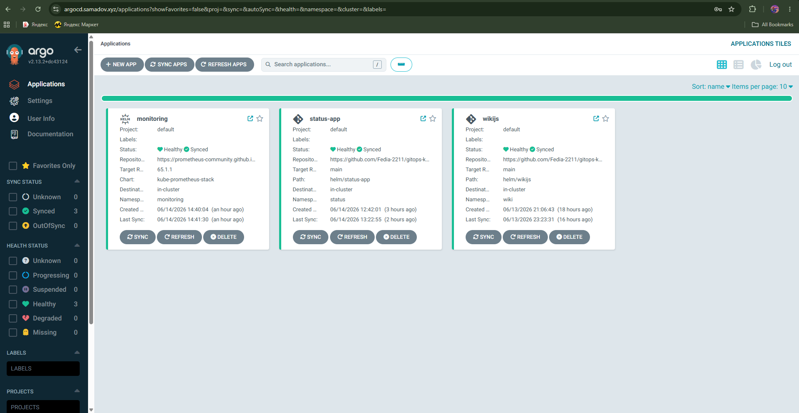
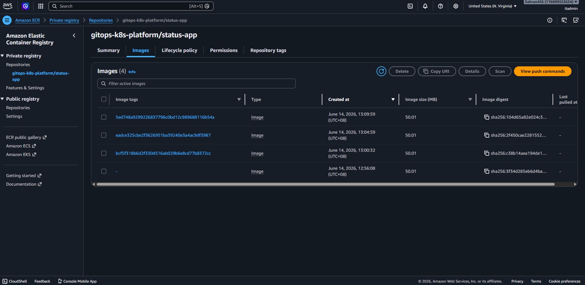
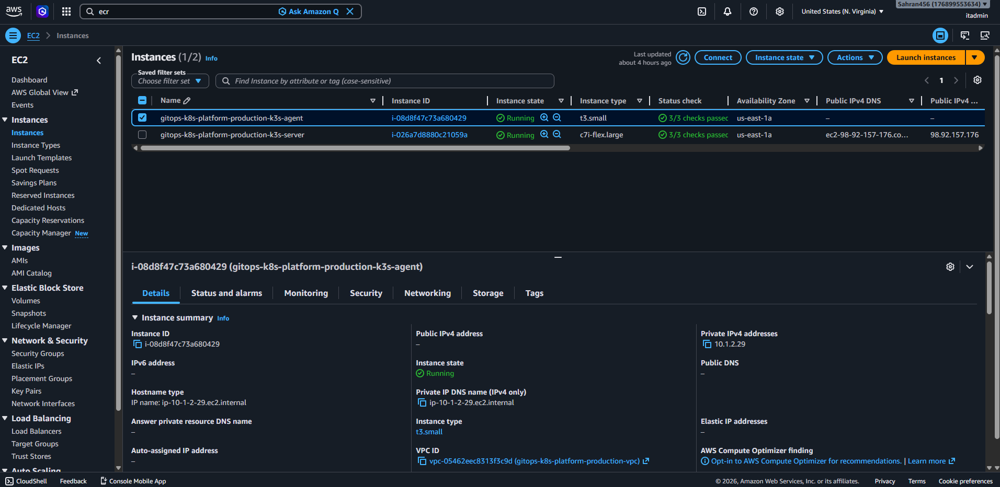
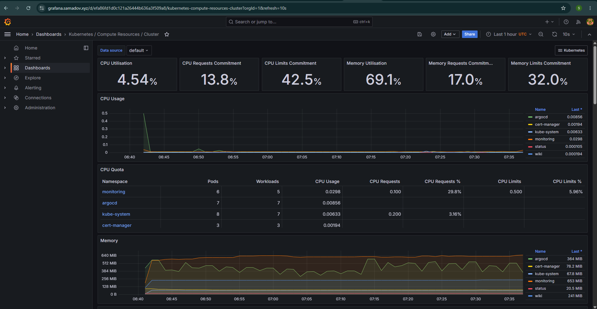
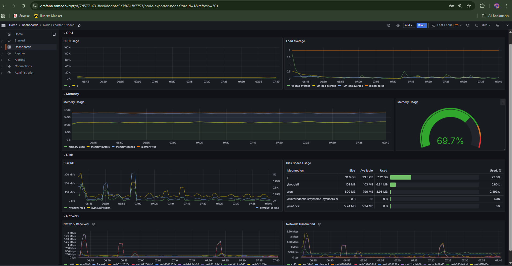
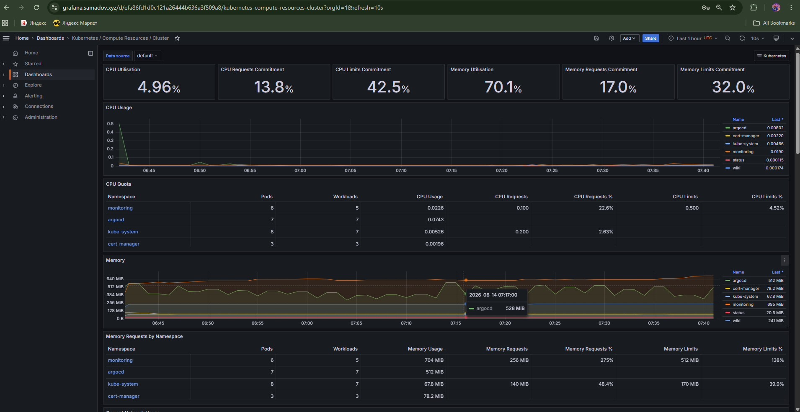
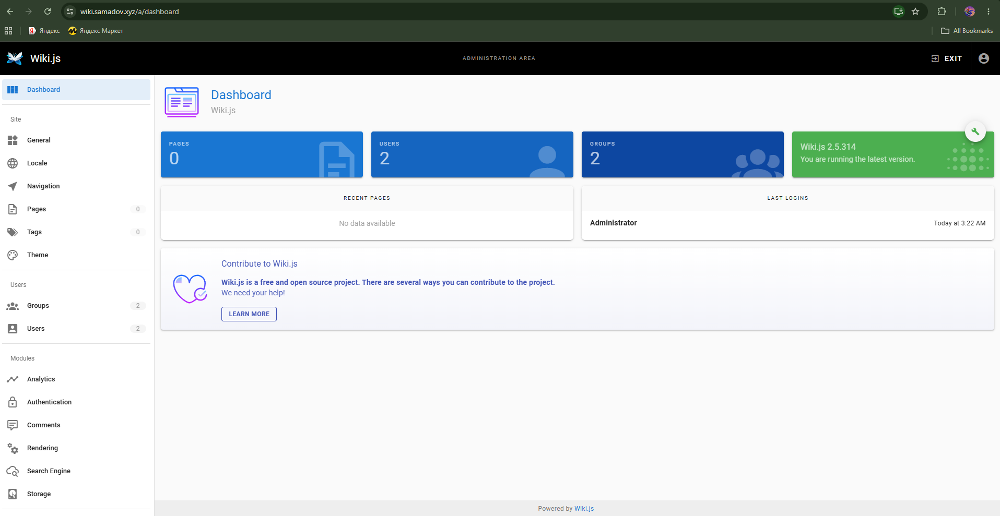
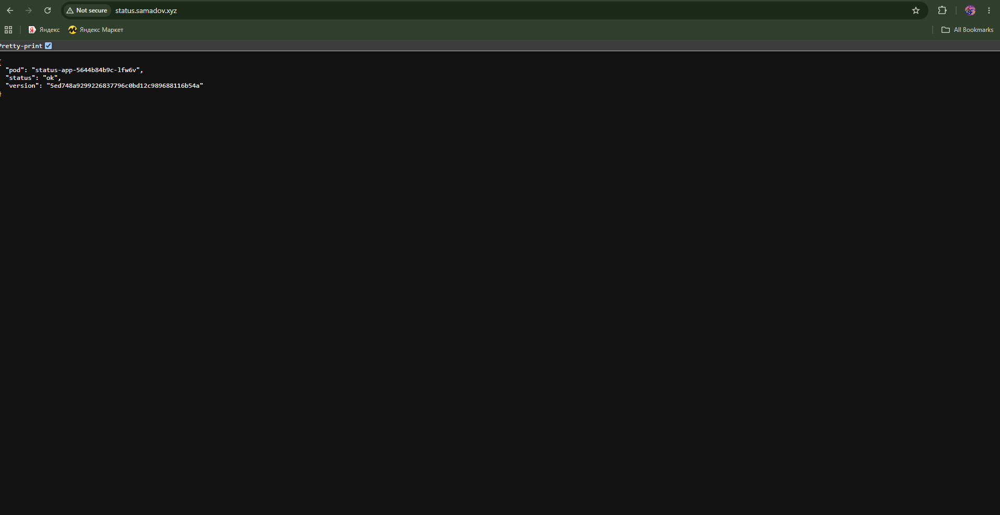

# gitops-k8s-platform

> Production-grade Kubernetes platform on AWS — GitOps with ArgoCD, full CI/CD via GitHub Actions, Prometheus/Grafana monitoring. Deploys real self-hosted applications (Wiki.js, custom microservice) on a 2-node k3s cluster with RDS Postgres and automatic HTTPS.

---

## Live Services

| Service | URL | Description |
|---------|-----|-------------|
| Wiki.js | https://wiki.samadov.xyz | Self-hosted wiki — Postgres backend |
| ArgoCD | https://argocd.samadov.xyz | GitOps dashboard — manages all deployments |
| Grafana | https://grafana.samadov.xyz | Kubernetes monitoring — 20+ dashboards |
| Status App | https://status.samadov.xyz | Custom microservice — CI/CD demo |

> Infrastructure is destroyed when not in use to minimize AWS costs. Full environment redeploys in under 20 minutes.

---

## Architecture

```
Developer
    │
    │ git push
    ▼
GitHub Repository
    │
    ├──► GitHub Actions CI
    │         │ docker build + push
    │         ▼
    │       AWS ECR
    │         │ update image tag in Helm values
    │         ▼
    │       GitHub (commit back)
    │
    └──► ArgoCD (watches repo, auto-syncs)
              │
              ▼
    ┌─────────────────────────────────────────────┐
    │              AWS VPC  10.1.0.0/16            │
    │                                              │
    │  ┌──────────────────────────────────────┐   │
    │  │     Public subnet  10.1.1.0/24       │   │
    │  │                                      │   │
    │  │  ┌────────────────────────────────┐  │   │
    │  │  │   k3s server (control-plane)   │  │   │
    │  │  │   Ubuntu 22.04 · t3.medium     │  │   │
    │  │  │                                │  │   │
    │  │  │  ArgoCD · Traefik · cert-mgr   │  │   │
    │  │  │  Wiki.js · Status App          │  │   │
    │  │  │  Prometheus · Grafana          │  │   │
    │  │  └────────────────────────────────┘  │   │
    │  └──────────────────────────────────────┘   │
    │                                              │
    │  ┌──────────────────────────────────────┐   │
    │  │    Private subnet  10.1.2.0/24       │   │
    │  │                                      │   │
    │  │  ┌──────────────┐  ┌──────────────┐ │   │
    │  │  │  k3s agent   │  │ NAT Gateway  │ │   │
    │  │  │  t3.small    │  │              │ │   │
    │  │  │  worker node │  │              │ │   │
    │  │  └──────────────┘  └──────────────┘ │   │
    │  └──────────────────────────────────────┘   │
    │                                              │
    │  ┌──────────────────────────────────────┐   │
    │  │  Private subnet 2  10.1.3.0/24       │   │
    │  │  RDS Postgres 15 · db.t3.micro       │   │
    │  └──────────────────────────────────────┘   │
    └─────────────────────────────────────────────┘

    AWS Managed Services (outside VPC)
    ┌──────────┐  ┌──────────┐  ┌──────────┐
    │   ECR    │  │ Route 53 │  │ Secrets  │
    │ Container│  │   DNS    │  │ Manager  │
    │ Registry │  │          │  │          │
    └──────────┘  └──────────┘  └──────────┘
```

---

## Tech Stack

| Category | Technology |
|----------|-----------|
| Cloud | AWS — EC2, RDS, ECR, Route 53, VPC, Secrets Manager |
| IaC | Terraform 1.x — 4 modules (vpc, compute, security, rds) |
| Kubernetes | k3s v1.35 — 2-node cluster (control-plane + worker) |
| GitOps | ArgoCD v2.13 — app-of-apps pattern |
| CI/CD | GitHub Actions — build → ECR → Helm update → ArgoCD sync |
| Ingress | Traefik (built-in k3s) |
| TLS | cert-manager + Let's Encrypt (auto-renewing) |
| Monitoring | kube-prometheus-stack (Prometheus + Grafana + Node Exporter) |
| Packaging | Helm 3 — custom charts for all apps |
| Database | AWS RDS Postgres 15 — managed, private subnet |
| Container Registry | AWS ECR — private, IAM-authenticated |
| Apps | Wiki.js 2.5 · Custom Flask microservice |
| OS | Ubuntu 22.04 LTS |
| Domain | samadov.xyz via Route 53 |

---

## Project Structure

```
gitops-k8s-platform/
├── terraform/
│   ├── modules/
│   │   ├── vpc/          # VPC, subnets, NAT gateway, route tables
│   │   ├── compute/      # k3s server (t3.medium) + agent (t3.small)
│   │   ├── security/     # Security groups (k3s-server, k3s-agent, rds)
│   │   └── rds/          # RDS Postgres 15, subnet group, parameter group
│   └── environments/
│       └── production/   # Main entry point (main.tf, variables, outputs)
├── apps/
│   └── status-app/       # Custom Flask microservice
│       ├── app.py        # Returns pod hostname + git SHA version
│       └── Dockerfile
├── helm/
│   ├── wikijs/           # Custom Helm chart — Wiki.js deployment
│   │   ├── Chart.yaml
│   │   ├── values.yaml
│   │   ├── files/        # RDS CA certificate bundle
│   │   └── templates/    # Deployment, Service, Ingress, ConfigMap
│   └── status-app/       # Custom Helm chart — CI/CD demo app
│       ├── Chart.yaml
│       ├── values.yaml   # Image tag auto-updated by GitHub Actions
│       └── templates/    # Deployment, Service, Ingress
├── kubernetes/
│   └── argocd-apps/      # ArgoCD Application manifests
│       ├── wikijs.yaml
│       ├── status-app.yaml
│       └── monitoring.yaml
└── .github/
    └── workflows/
        └── build-status-app.yml  # GitHub Actions CI pipeline
```

---

## GitOps Flow (How Deployments Work)

```
1. Developer pushes code to apps/status-app/
        │
        ▼
2. GitHub Actions triggers automatically
   - Builds Docker image
   - Tags with git commit SHA
   - Pushes to AWS ECR
   - Updates helm/status-app/values.yaml with new tag
   - Commits updated values back to GitHub
        │
        ▼
3. ArgoCD detects change in GitHub (polls every 3 min)
   - Compares live cluster state vs Git state
   - Finds new image tag in values.yaml
   - Applies Helm chart to cluster
   - New pods roll out automatically
        │
        ▼
4. Live at https://status.samadov.xyz
   Returns: { "pod": "...", "status": "ok", "version": "<git-sha>" }
```

**No manual deployment steps.** Git push = production deploy.

---

## Deployment

### Prerequisites
- AWS account with IAM permissions
- Terraform 1.x
- kubectl
- SSH key pair in AWS EC2
- Domain in Route 53

### Step 1 — Deploy Infrastructure

```bash
cd terraform/environments/production
cp terraform.tfvars.example terraform.tfvars
# Edit terraform.tfvars with your values

terraform init
terraform plan
terraform apply
```

Creates: VPC, 2 subnets, NAT Gateway, 2 EC2 instances, RDS Postgres, Security Groups.

### Step 2 — Install k3s cluster

```bash
# SSH to server node
ssh -i ~/.ssh/key.pem ubuntu@<SERVER_PUBLIC_IP>

# Install k3s server
curl -sfL https://get.k3s.io | sh -

# Get join token
sudo cat /var/lib/rancher/k3s/server/node-token

# SSH to agent node (via server as jump host)
ssh -J ubuntu@<SERVER_IP> ubuntu@<AGENT_PRIVATE_IP>

# Join as worker
curl -sfL https://get.k3s.io | \
  K3S_URL=https://<SERVER_PRIVATE_IP>:6443 \
  K3S_TOKEN=<TOKEN> sh -
```

### Step 3 — Configure kubectl locally

```bash
# Get kubeconfig from server
sudo cat /etc/rancher/k3s/k3s.yaml
# Replace 127.0.0.1 with server public IP
# Save to ~/.kube/config

kubectl get nodes  # Should show 2 nodes
```

### Step 4 — Install platform tools

```bash
# cert-manager
kubectl apply -f https://github.com/cert-manager/cert-manager/releases/download/v1.15.3/cert-manager.yaml

# Create ClusterIssuer for Let's Encrypt
kubectl apply -f - <<EOF
apiVersion: cert-manager.io/v1
kind: ClusterIssuer
metadata:
  name: letsencrypt-prod
spec:
  acme:
    server: https://acme-v02.api.letsencrypt.org/directory
    email: your@email.com
    privateKeySecretRef:
      name: letsencrypt-prod-key
    solvers:
    - http01:
        ingress:
          ingressClassName: traefik
EOF

# ArgoCD
kubectl create namespace argocd
kubectl apply -n argocd -f https://raw.githubusercontent.com/argoproj/argo-cd/v2.13.2/manifests/install.yaml
kubectl patch configmap argocd-cmd-params-cm -n argocd --type merge -p '{"data":{"server.insecure":"true"}}'
```

### Step 5 — Deploy applications via ArgoCD

```bash
# Deploy all apps at once
kubectl apply -f kubernetes/argocd-apps/
```

ArgoCD auto-syncs all applications from Git. All apps deploy automatically.

### Step 6 — Update DNS

Point these A records to your k3s server public IP in Route 53:
- `wiki.samadov.xyz`
- `argocd.samadov.xyz`
- `grafana.samadov.xyz`
- `status.samadov.xyz`

---

## Monitoring

Grafana at `https://grafana.samadov.xyz` includes 20+ pre-built dashboards:

| Dashboard | Shows |
|-----------|-------|
| Kubernetes / Compute Resources / Cluster | CPU, memory across all namespaces |
| Kubernetes / Compute Resources / Node | Per-node resource breakdown |
| Kubernetes / Compute Resources / Pod | Individual pod metrics |
| Node Exporter / Nodes | Disk I/O, network, system metrics |

**Current cluster metrics:**
- CPU Utilisation: ~4.5% (healthy, low)
- Memory Utilisation: ~70% (expected for loaded cluster)
- Namespaces monitored: argocd, wiki, status, monitoring, kube-system

---

## Screenshots

### ArgoCD — 3 Applications, All Healthy


### AWS ECR — status-app image tags


### AWS EC2 — k3s server and agent instances


### Grafana — Kubernetes cluster dashboard


### Grafana — Node Exporter system metrics


### Grafana — Dashboard overview or alerts


### Wiki.js — Live self-hosted wiki


### Status App — CI/CD demo (shows live git SHA)


---

## Key Engineering Decisions

**Why k3s instead of EKS?**
k3s is a CNCF-certified, production-grade Kubernetes distribution used by companies like Rancher, Deutsche Telekom, and many edge computing deployments. It runs the exact same Kubernetes API as EKS — all skills transfer directly. Cost: ~$4/day vs ~$9.50/day for EKS, saving ~$28 over the project week.

**Why custom Helm charts instead of pre-made ones?**
Writing our own charts demonstrates understanding of Kubernetes primitives (Deployment, Service, Ingress, ConfigMap, Secret) rather than just running `helm install`. Each template is intentional — not generated boilerplate.

**Why Traefik instead of nginx-ingress?**
Traefik ships built-in with k3s and binds directly to ports 80/443 via hostNetwork — no NodePort complexity. For a 2-node cluster this is the correct, lower-overhead choice.

**Why RDS instead of in-cluster Postgres?**
Running stateful databases in Kubernetes adds significant operational complexity (PersistentVolumes, backup operators, recovery procedures). RDS provides managed backups, automated failover, and point-in-time recovery — the correct production trade-off.

---

## Real Problems Solved

| Problem | Root Cause | Fix |
|---------|-----------|-----|
| k3s agent can't join | Token file permissions | Run as `sudo`, private IP for K3S_URL |
| Traefik vs nginx-ingress port conflict | Both trying to bind port 80/443 | Removed nginx-ingress, used built-in Traefik |
| RDS SSL cert rejection | Wiki.js Node.js didn't trust Amazon CA | Downloaded RDS global CA bundle, mounted via ConfigMap |
| `.pem` file not in Git | `.gitignore` had `*.pem` rule | Added explicit exception with `git add -f` |
| ArgoCD empty ConfigMap | Helm `.Files.Get` with wrong template syntax | Fixed to `{{- .Files.Get ... \| nindent 4 }}` |
| ECR pull failure on k3s nodes | Nodes have no AWS credentials | Created `docker-registry` secret with ECR login token |
| GitHub Actions push rejected | ArgoCD committed while CI was pushing | Added `git pull --rebase` before push in workflow |
| Postgres permission denied | PG15 changed public schema default permissions | `GRANT ALL ON SCHEMA public TO wikijs_user` |

---

## Cost

| Resource | Daily cost |
|----------|-----------|
| t3.medium (k3s server) | $2.16 |
| t3.small (k3s agent) | $1.08 |
| RDS db.t3.micro | $0.60 |
| NAT Gateway | $1.08 |
| **Total running** | **~$4.92/day** |

Stopped overnight (EC2 + RDS stopped, NAT Gateway left running): ~$1.08/day baseline.

---

## Author

**Firdavs Samadov**
DevOps & Cloud Engineering Master's Student
2 years networking (Cisco CCNA 1–3) · 1 year Systems Administration

[GitHub](https://github.com/Fedia-2211) · [LinkedIn](#)
